<div align="center">

# Maria Aleana De Leon

### Medico-Legal Operations Manager • AI & Automation Specialist • Product Builder

Mechanical Engineering student building practical AI tools, automations, and digital products.

<br>

<a href="https://aleanadeleon.com"></a>
&nbsp;&nbsp;
<a href="https://www.linkedin.com/in/mariaaleana/"></a>
&nbsp;&nbsp;
<a href="https://www.facebook.com/Aleana8/"></a>
&nbsp;&nbsp;
<a href="mailto:Hell@aleanadeleon.com"></a>
&nbsp;&nbsp;
<a href="https://www.instagram.com/xoxo_aleanaaa/"></a>
&nbsp;&nbsp;
<a href="https://discord.gg/nQPErZdpZr"></a>

<br>


</div>

<br>

---

<br>

<p align="center">
  
  
</p>

<br>

---

## ⚡ Tech Arsenal

<div align="center">


&nbsp;

&nbsp;

&nbsp;

&nbsp;

&nbsp;


<br><br>


&nbsp;

&nbsp;

&nbsp;

&nbsp;

&nbsp;


</div>

<br>

---

## 🚀 What I'm Building

### Resumie.io

AI-powered career tools for resumes, portfolios, cover letters, and applications.

### AI + Automation

Practical workflows using AI agents, Claude Code, Codex, APIs, and automation tools.

### Medico-Legal Operations

Systems, document workflows, case organization, and AI-assisted operations for complex medico-legal work.

### Arch Lab

A community for builders experimenting with AI, automation, products, and technology.

<br>

---

## 👩🏻‍💻 Current Focus

```js
const aleana = {
  role: "Medico-Legal Operations Manager",
  studying: "Mechanical Engineering",
  building: "Resumie.io",
  focus: [
    "AI",
    "Automation",
    "Product Building",
    "Medico-Legal Tech"
  ],
  tools: [
    "Claude Code",
    "Codex",
    "OpenAI",
    "n8n",
    "Supabase",
    "Vercel"
  ]
}
